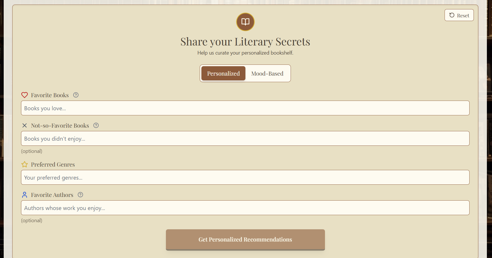
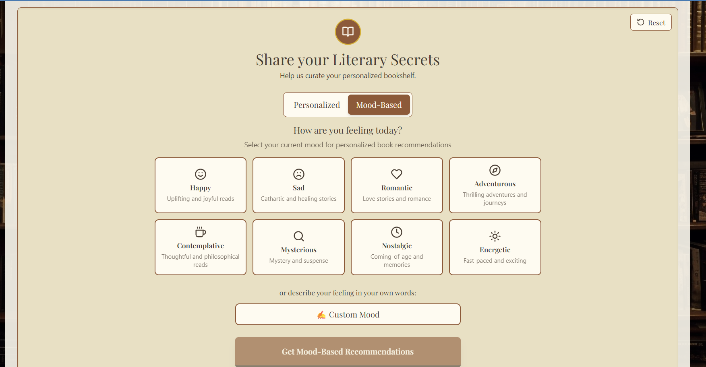

# NovelQuest - AI-Powered Book Recommendations

Welcome to NovelQuest — an intelligent book recommendation app that helps you find your next great read. NovelQuest now supports both preference-based and mood-based recommendations powered by the Groq API.

## Table of Contents

- [Features](#features)
- [How It Works](#how-it-works)
- [Tech Stack](#tech-stack)
- [Project Structure](#project-structure)
- [Live Demo](#live-demo)
- [Screenshots](#screenshots)
- [How Recommendations Work](#how-recommendations-work)
- [Components](#components)
- [Contributing](#contributing)
- [License](#license)

## Features

- **Personalized Recommendations**: Get book suggestions based on your unique reading profile.
- **Favorite Books & Authors**: Tell us what you love, and we'll find similar titles and authors.
- **Genre Preferences**: Specify your favorite genres to narrow down recommendations.
- **Least Favorite Books**: Exclude books you didn't enjoy for more accurate results.
- **Mood-based Recommendations**: Tell us how you're feeling and get 6 mood-appropriate books selected to match or uplift your mood.
- **Sleek, Modern UI**: A clean and intuitive interface for a seamless user experience.

## How It Works

NovelQuest uses the Groq API (via the Groq SDK) to generate recommendations. You can request either:

- Personalized recommendations based on favorite books, authors, and preferred genres.
- Mood-based recommendations: specify a current mood (for example: "happy", "sad", "adventurous") and receive exactly 6 books selected to suit that mood.

## Tech Stack

- **Frontend**: Next.js, React, Tailwind CSS
- **AI**: Groq API

## Project Structure

```
NovelQuest/
├── package.json
├── next.config.ts
├── public/
└── src/
    ├── app/
    │   ├── api/
    │   │   └── route.ts
    │   ├── globals.css
    │   ├── layout.tsx
    │   └── page.tsx
    ├── components/
    │   ├── BookRecommendationForm.tsx
    │   ├── BookRecommendations.tsx
    │   └── Header.tsx
    └── types/
        └── book.ts
```

## Live Demo

Try the live site at: https://novel-quest.vercel.app/

This repository is the source for the live demo — you don't need to run anything locally to try NovelQuest.

## Screenshots



*Landing / hero section*


*Example recommendations results*



*Recommendation form*

## How Recommendations Work

The application provides server-side recommendation logic (implemented in a Next.js API route) that accepts either preference-based or mood-based requests. Inputs the server reads include:

- favoriteBooks (string, optional)
- leastFavoriteBooks (string, optional)
- preferredGenres (string, optional)
- favoriteAuthors (string, optional)
- excludedTitles (array of strings, optional)
- mood (string, optional) — when present, the server will use the mood-based recommendation flow and return exactly 6 books
- requestType (string) — indicates which mode to use (e.g., "preferences" or "mood")

The server constructs a model prompt and calls the Groq SDK. Responses are expected as a strict JSON array of book objects containing at least title, author, genre, and description. The server validates and parses the model output before forwarding it to the client.

## Components

The `src/components` directory contains the main React components for the application.

### BookRecommendationForm

- **File**: `src/components/BookRecommendationForm.tsx`
- **Description**: A form for users to input reading preferences. In addition to favorites and preferred genres, the form now supports a "mood" input so users can request mood-based recommendations. The form sends the selected request type to the server (`preferences` or `mood`).

### BookRecommendations

- **File**: `src/components/BookRecommendations.tsx`
- **Description**: Displays recommended books in a clean, card-based layout. Each recommendation shows title, author, genre, and a short description explaining why it was recommended.

## Contributing

Contributions are welcome! If you have any ideas, suggestions, or bug reports, please open an issue or submit a pull request.

## License

This project is licensed under the MIT License. 